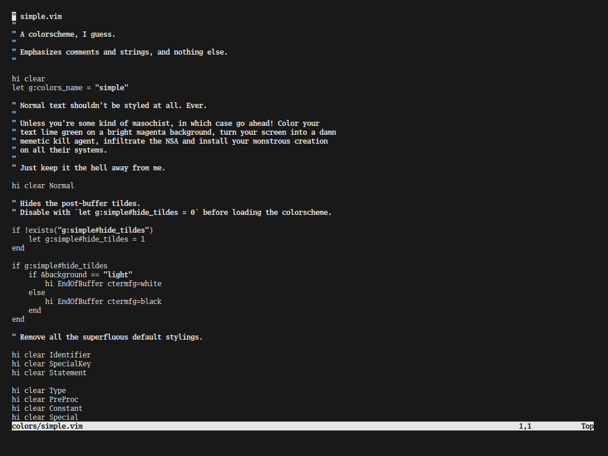
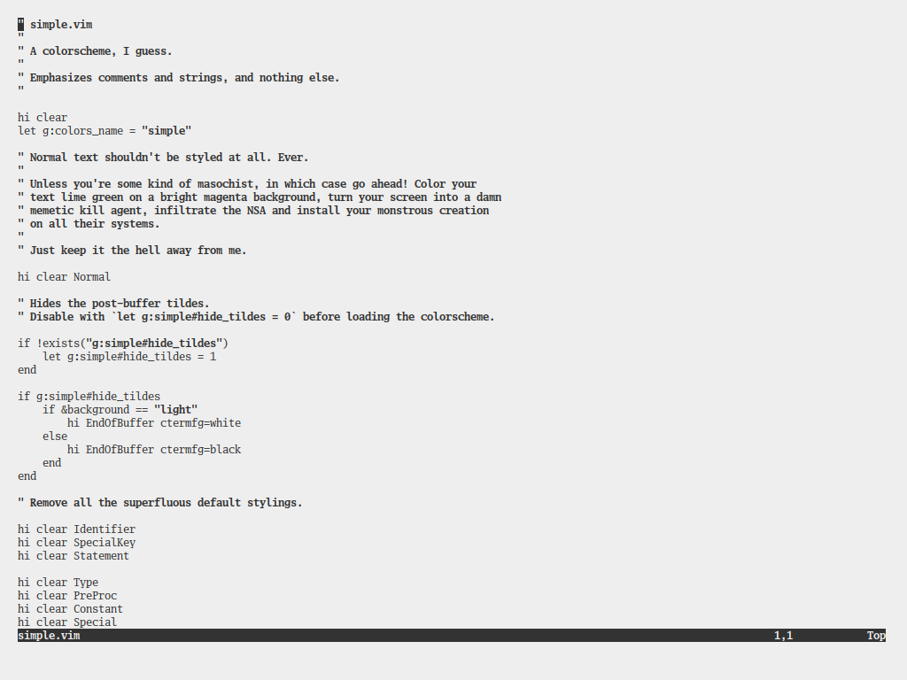

# simple.md

# Installation

Lots of ways you can do this, I expect;
<a href="https://github.com/junegunn/vim-plug">vim-plug</a>
is probably my favorite of the lot:

    Plug 'dragonsourced/simple.vim'

If you don't want to bother, you can just drop `colors/simple.vim` into
`~/.nvim/colors`, or `~/.vim/colors`, or wherever you keep your colorschemes.

# Configuration

`simple.vim` hides the tiles at the end of the buffer by default, but you can
change this behaviour very easily:

    let g:simple#hide_tildes = 0
